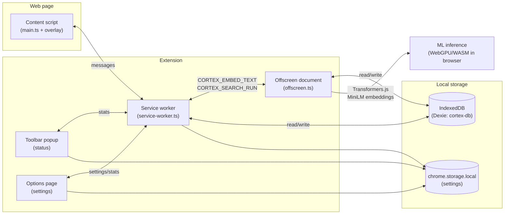

# Cortex — Architecture, UI & ML

This document describes the **implemented** browser extension: layers, data flows, user-facing surfaces, and the retrieval / embedding logic (no remote LLM APIs).

---

## 1. Product intent

**Cortex** is a **privacy-first, local-only** Chrome extension (Manifest V3) that indexes readable page text into **chunk-level records** with **optional sentence embeddings**, stores everything in **IndexedDB**, and exposes **hybrid search** (semantic + lexical + recency + engagement) plus lightweight **natural-language hints** (time ranges, entities, “LinkedIn-style” boosts)—all **on device**.

---

## 2. High-level architecture

### Runtime roles

| Piece | Role |
|--------|------|
| **Content script** (`content.js`) | Text extraction (sanitized clone for Readability), SPA hooks, indexing requests, **Shadow DOM search overlay**, related-chip UI (global CSS). |
| **Service worker** | Orchestration: indexing gates (privacy), chunk persistence + **embedding queue** + **`markChunkEmbedFailed`**, relays **search** to offscreen, **popup/options** APIs (`CORTEX_STATS`). |
| **Toolbar popup** | Minimal **status**: counts, indexing paused/active, button to **open options**. |
| **Options page** | Privacy controls (pause, blocklist), stats, recent visits, storage placeholder copy. |
| **Offscreen document** | Long-lived page for **Transformers.js** (`@xenova/transformers`): chunk embeddings, query embeddings, and **`runAdvancedSearch`** (Dexie + BM25 + fusion). Moving search here avoids MV3 service-worker suspension interrupting long `sendMessage` replies. |
| **IndexedDB (`cortex-db`)** | Documents, chunks (with optional embedding vectors), visit log, legacy `pages` table for migrations. |
| **chrome.storage.local** | User settings: pause indexing, domain blocklist, etc. (`extension-settings.ts`). |

### Message types (representative)

- **Content → SW:** `CORTEX_INDEX`, (overlay → SW) `CORTEX_SEARCH`.
- **SW → Offscreen:** `CORTEX_EMBED_TEXT` (indexing pipeline), `CORTEX_SEARCH_RUN` (execute search + reply).
- **SW ignores** `CORTEX_EMBED_TEXT` and `CORTEX_SEARCH_RUN` in its own listener so only offscreen answers those broadcasts.

---

## 3. Data model (IndexedDB)

Implemented in `src/db/schema.ts` (Dexie **v5**: chunk/embed fields from v4; **v5** adds `conversations`, `messages`, `digestCache` for Ask/Digest — see `docs/CORTEX_HANDOFF_REPORT.md`).

| Store | Purpose |
|-------|---------|
| **`documents`** | One row per canonical URL: `url`, `domain`, `title`, `summary`, `lastVisitedAt`, `visitCount`, `importanceScore` (0–1 engagement roll-up). |
| **`chunks`** | Many rows per document: `documentId`, `ord`, `text`, optional **`embedding`**, optional **`embedState`** (`pending` \| `embedded` \| `failed` \| `skipped`), **`embedModelId`**, **`embedUpdatedAt`**. |
| **`visitLog`** | Append-only visits for **time filtering** in search (`visitedAt`, `url`, …). Trimmed at a large cap. |
| **`pages`** | Legacy; migration source for v3. |

---

## 4. Indexing pipeline

1. **Extract** article-like text from the DOM (Readability-based path + helpers in `extract`).
2. **Summarize** locally (`summarize.ts`) for document `summary` field.
3. **Chunk** full text with a sliding window (`chunking.ts`):
   - Target **~420 words** per chunk, **~75 words overlap**, max **36 chunks/page** (fallback single slice if tiny).
4. **Upsert** `documents` + replace `chunks` for that URL.
5. **Queue embeddings** per chunk in the service worker: **`ensureOffscreen()`** then **`CORTEX_EMBED_TEXT`** with chunk text; offscreen runs the model and SW **`setChunkEmbedding`** on the chunk row.

**Privacy gates** (before indexing): paused indexing, incognito tab, allowlist-only mode, blocklist, sensitive-hostname heuristics (`privacy.ts`, `shouldSkipIndexing` in SW).

### 4.1 DOM sanitization (trust)

Before running **Readability** on a cloned document, `sanitizeDomForExtraction` in `extract.ts` removes **scripts, styles, noscript, iframes, forms, inputs, textareas, selects, buttons**, and similar nodes so fewer credentials / tokens enter the index. Fallback extraction paths (`innerText` / site helpers) still use the live DOM (future work: optional redaction pass on strings).

---

## 5. Search pipeline & ML logic

Search execution lives in **`src/lib/search-engine.ts`**, invoked from **`offscreen.ts`** via `runAdvancedSearch(rawQuery, embedQuery)`.

### 5.1 Embedding model (ML)

- **Library:** `@xenova/transformers` (runs in the **offscreen** page).
- **Model id:** `Xenova/all-MiniLM-L6-v2` (`CORTEX_EMBED_MODEL_ID` in `src/shared/embed-model.ts`).
- **Inference:** `pipeline("feature-extraction", …)`, **`pooling: "mean"`**, **`normalize: true`** → **unit-norm** embedding vectors suitable for **cosine similarity ≈ dot product**.
- **Typical dimension:** **384** floats per vector (stored per chunk; query vector computed the same way).
- **Cosine similarity:** Standard dot-product formula on equal-length vectors (`similarity.ts`).
- **Bundled vs remote:** Offscreen **probes** `models/Xenova/all-MiniLM-L6-v2/tokenizer.json`. If packaged (`vendor/models/` → `dist/models/` via webpack), **`env.allowRemoteModels = false`** and **`env.localModelPath`** is set. Otherwise weights may still load from **`cdn.jsdelivr.net`** / **`huggingface.co`** (manifest `host_permissions`). See `vendor/models/README.md`.

### 5.1b Embedding lifecycle (chunks)

New chunks are stored with **`embedState: pending`**. Successful **`setChunkEmbedding`** sets **`embedded`** plus **`embedModelId`** / **`embedUpdatedAt`**; the SW queue calls **`markChunkEmbedFailed`** on failure.

### 5.2 Query embedding

- Offscreen builds **`embedQueryForSearch(text)`** with the **same pipeline** as indexing (truncation ~8k chars, whitespace normalized).
- If embedding fails or returns null, search **continues with lexical + recency only** (BM25 path); UI may note that embedding was skipped.

### 5.3 Lexical retrieval — BM25 (Okapi-style)

Implemented per **chunk** over a concatenated corpus:

`corpus = title + summary + chunk.text`

- **Tokenization:** lowercase alphanumeric tokens, length ≥ 2 (`/[a-z0-9]{2,}/g`).
- **Statistics:** Document frequency **per query term** across chunks; **average chunk length** (`avgdl`) for length normalization.
- **BM25 parameters (code):** `k1 = 1.35`, `b = 0.78`.
- **IDF:** `log(1 + (N - df + 0.5) / (df + 0.5))` with **N = chunk count**.
- Raw BM25 scores are **min–max normalized across all chunks** before fusion (`minMaxNorm`), so scale tracks the current index.

### 5.4 Semantic score

- For each chunk with a stored **`embedding`**, compute **cosine similarity** between **query vector** and **chunk vector**.
- **`hasSemantic`** (for fusion): cosine above a small threshold **and** both vectors present (implementation uses ~**0.025** gate with vectors).

### 5.5 Other signals

- **Title alignment:** `titleMatchScore` — fraction of query words found in title (`ranking.ts`).
- **Recency:** `recencyBoost(visitedAt)` — exponential decay with **~18-day half-life** (`ranking.ts`).
- **Engagement:** document `importanceScore` (clamped 0–1), increased on revisits / content length during upsert.

### 5.6 Fusion (`fuseRankScore` in `search-engine.ts`)

Define **`lexicalBlend = 0.72 * bm25Norm + 0.28 * titleMatch`**.

**When `hasSemantic` is true:**

| Component | Weight |
|-----------|--------|
| Cosine | **0.48** |
| Lexical blend | **0.24** |
| Recency | **0.12** |
| Engagement | **0.16** |

**When `hasSemantic` is false:**

| Component | Weight |
|-----------|--------|
| Lexical blend | **0.52** |
| Recency | **0.26** |
| Engagement | **0.22** |

Additional **bonuses** (capped with global score clamp): entity terms from `parseAskQuery`, LinkedIn URL boost when the query looks profile-related.

### 5.7 Aggregation & filtering

- Keep **best chunk score per document** (dedupe by `documentId`).
- **Adaptive cutoff** vs top score (floor/ceiling clamped in code) instead of a single global threshold.
- Optional **`parseAskQuery` time range** filters URLs against **`visitLog`**; if no hits in range, search can **relax** time filter (tracked for evidence text).

### 5.8 Natural-language hints (`query-parse.ts`)

**No cloud LLM.** Rules extract:

- **Time phrases:** yesterday / today / last week / last month → `timeRange`.
- **Quoted strings**, regex patterns (`works at`, CamelCase tokens), **stopword list** for entity cleanup.
- **`preferLinkedIn`** when wording suggests profiles / LinkedIn.

Outputs feed **`buildEvidenceIntro`** for short explanatory lines in results.

---

## 6. UI surfaces

### 6.1 Toolbar popup (`popup.html` + `popup.ts`)

- **Snapshot:** document / chunk / visit counts via `CORTEX_STATS`.
- **Indexing line:** active vs paused (reads `chrome.storage.local` settings).
- **“Open settings”** calls `chrome.runtime.openOptionsPage()` for privacy controls.
- Shortcut hint + link to `chrome://extensions/shortcuts`.

### 6.2 Options page (`options.html` + `options.ts` + `options.css`)

- Full **privacy** UI: pause indexing, blocked domains, save.
- Same stats + **recent visits** as earlier popup (moved here).
- Placeholder note for future storage breakdown.
- Registered in `manifest.json` as **`options_ui`** (`open_in_tab: true`).

### 6.3 In-page overlay (`overlay.ts` + `overlay.shadow.css`)

- Opened via **`chrome.commands`** → SW → **`CORTEX_OPEN_SEARCH`** (open-only).
- **Shadow DOM** (`attachShadow`) isolates Cortex styles from host pages; styles compiled from **`overlay.shadow.css`** (Webpack `asset/source`).
- **Confidence labels:** **Strong / Good / Possible match** from relative score vs batch max (`confidence.ts`); raw fusion score on **`title` hover**.
- Results still render via **`textContent`-safe escaping** (`esc()`).

### 6.4 Evaluation harness (future regression suite)

Example fixtures live under **`eval/`** (`fixtures.example.json`, `README.md`). A production harness should run ranked retrieval against frozen IndexedDB snapshots or headless Chrome CI—see `eval/README.md`.

---

## 7. Keyboard shortcuts

Declared in `manifest.json` under **`commands`**:

| Command ID | Default binding |
|------------|-------------------|
| `open-cortex-search` | **Ctrl+Shift+K** (Windows/Linux), **Cmd+Shift+K** (macOS) |
| `open-cortex-search-alt` | **Alt+Shift+C** |

Shortcuts are **handled only via `chrome.commands`** (no duplicate in-page listener for the same chord) so the overlay does not open-then-close.

---

## 8. Build / ship notes

- Bundled with **Webpack**; outputs live under **`dist/`** (`content.js`, `service-worker.js`, `offscreen.js`, `popup.js`, `options.js`, assets).
- Load **unpacked** `dist/` in `chrome://extensions` for development.

---

## 9. File map (core)

| Area | Files |
|------|--------|
| Background | `src/background/service-worker.ts` |
| Offscreen ML + search runner | `src/offscreen/offscreen.ts` |
| Retrieval | `src/lib/search-engine.ts`, `src/lib/similarity.ts`, `src/lib/ranking.ts`, `src/lib/query-parse.ts` |
| Chunking | `src/lib/chunking.ts` |
| DB | `src/db/schema.ts` |
| Content / UI | `src/content/main.ts`, `overlay.ts`, `overlay.shadow.css`, `confidence.ts`, `extract.ts` |
| Popup | `src/popup/popup.html`, `popup.ts`, `popup.css` |
| Options | `src/options/options.html`, `options.ts`, `options.css` |
| Vendor ML | `vendor/models/README.md` (optional bundled weights) |
| Eval | `eval/README.md`, `eval/fixtures.example.json` |
| Manifest | `manifest.json` |

---

*Shadow DOM overlay, confidence labels, options split, extraction sanitization, chunk embed lifecycle fields, and bundled-model probe are documented above; iteration continues on storage caps and ANN indexing.*
