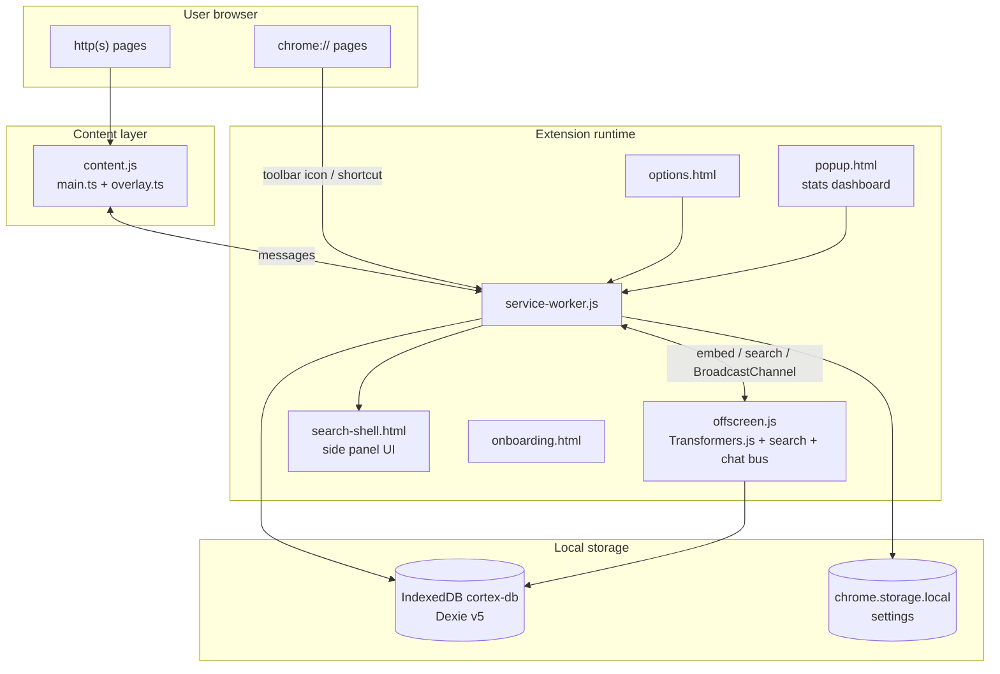
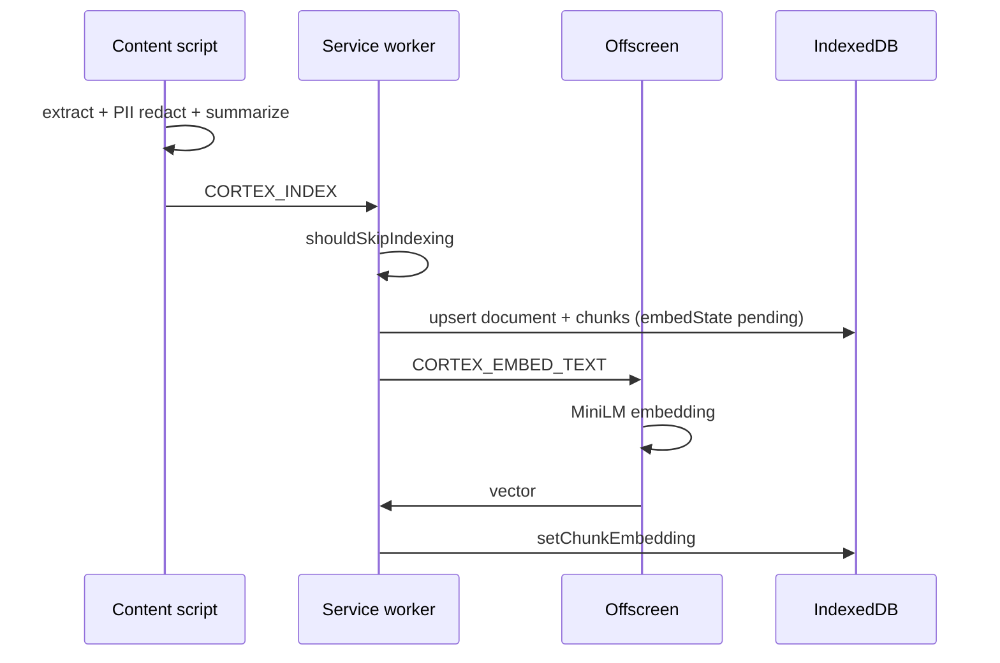
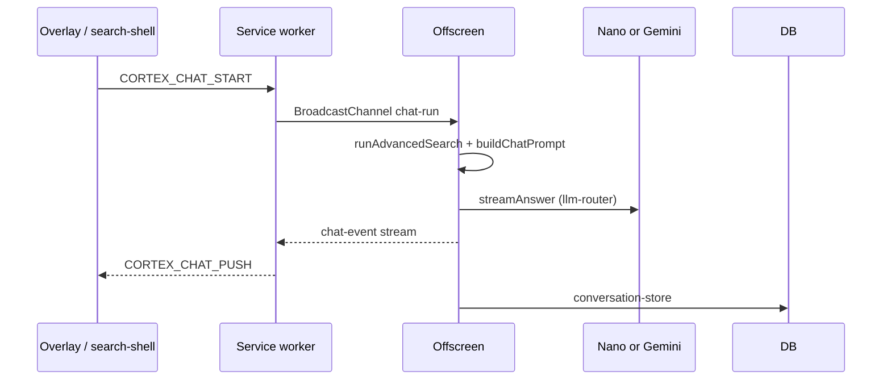

# Cortex — Architecture, UI & ML

This document describes the **implemented** Chrome extension (Manifest V3, v1.0.1): runtime layers, data flows, user-facing surfaces, retrieval / embedding logic, and optional chat backends.

---

## 1. Product intent

**Cortex** is a **privacy-first** Chrome extension that indexes readable page text into **chunk-level records** with **optional sentence embeddings**, stores everything in **IndexedDB**, and exposes:

- **Search** — hybrid retrieval (semantic + lexical + recency + engagement + query grounding)
- **Ask** — RAG chat over your library (on-device Chrome AI and/or optional Gemini)
- **Digest** — reading summaries over time ranges

**By default**, indexing, embeddings, and search run **entirely on device**. Optional **cloud chat** sends only **retrieved snippets** to Google Gemini when you enable it and add an API key in settings.

---

## 2. High-level architecture


```mermaid
flowchart TB
  subgraph Browser["User browser"]
    WEB["http(s) pages"]
    CHROME["chrome:// pages"]
  end

  subgraph Content["Content layer"]
    CS["content.js\nmain.ts + overlay.ts"]
  end

  subgraph Extension["Extension runtime"]
    SW["service-worker.js"]
    OS["offscreen.js\nTransformers.js + search + chat bus"]
    SHELL["search-shell.html\nside panel UI"]
    OPT["options.html"]
    POP["popup.html\nstats dashboard"]
    ONB["onboarding.html"]
  end

  subgraph Storage["Local storage"]
    IDB[("IndexedDB cortex-db\nDexie v5")]
    LS[("chrome.storage.local\nsettings")]
  end

  WEB --> CS
  CS <-->|messages| SW
  SW <-->|embed / search / BroadcastChannel| OS
  SW --> IDB
  OS --> IDB
  CHROME -->|toolbar icon / shortcut| SW
  SW --> SHELL
  OPT --> SW
  POP --> SW
  SW --> LS
```

### Runtime roles

| Piece | Role |
|--------|------|
| **Content script** (`content.js`) | DOM extraction (Readability + sanitization), SPA hooks, `CORTEX_INDEX`, **Shadow DOM overlay** (Search / Ask / Digest) on http(s) pages. |
| **Service worker** | Orchestration: privacy gates, indexing, embedding queue, tab/shortcut routing, chat/digest bus relay, stats/history APIs. |
| **Offscreen document** | **Transformers.js** embeddings, **`runAdvancedSearch`**, **`runChat`**, **`generateDigest`** — avoids MV3 SW suspension on long work. |
| **search-shell** | Same overlay UI in the **side panel** (or popup fallback) where content scripts cannot run (`chrome://`, etc.). |
| **Options page** | Privacy, blocklist, history import, chat mode, Gemini API key, shortcuts help, stats overview. |
| **Popup** | **Stats dashboard** only (opened from options); not the default toolbar action. |
| **IndexedDB (`cortex-db`)** | Documents, chunks, visit log, conversations, messages, digest cache. |
| **chrome.storage.local** | User settings (`extension-settings.ts`). |

### Why multiple runtimes?

| Runtime | Why |
|---------|-----|
| **Service worker** | Must stay small; can suspend — delegates ML and search. |
| **Offscreen** | ONNX/WASM inference + Dexie reads for search/chat at scale. |
| **Content script** | Needs live DOM for extract; injects overlay on normal sites. |
| **search-shell** | Extension page for UI on **restricted URLs** (no content script access). |

---

## 3. Entry points & open-search routing

### Toolbar icon

- **No `default_popup`** — `chrome.action.onClicked` opens Search / Ask / Digest **immediately**.
- **`http(s)`:** content overlay via `CORTEX_OPEN_SEARCH` (inject + message).
- **`chrome://`:** side panel (`search-shell.html`) via `openSearchSidePanelReliable()`; popup-window fallback if panel cannot open.

Implementation: `open-cortex-search.ts`, `side-panel-launcher.ts`, `active-tab-cache.ts` (sync tab snapshot for keyboard shortcuts).

### Keyboard shortcuts

| Command ID | Default binding |
|------------|-----------------|
| `open-cortex-search` | **Ctrl+Shift+K** (Windows/Linux), **Cmd+Shift+K** (macOS) |
| `open-cortex-search-alt` | **Alt+Shift+C** |

Handled in the service worker (`handleSearchCommand` → `openCortexSearchFromShortcut`). A **keydown fallback** in `overlay.ts` also opens the overlay when the chord is not consumed by the page (open-only, idempotent).

Customize bindings at `chrome://extensions/shortcuts`.

### Settings & onboarding

- **Options** (`options_ui`, `open_in_tab: true`): full privacy and chat configuration.
- **Gear icon** in overlay header → `CORTEX_OPEN_OPTIONS`.
- **Onboarding** tab on first install; optional **30-day history backfill** with notifications.

---

## 4. Data model (IndexedDB)

Implemented in `src/db/schema.ts` (Dexie **v5**, `CORTEX_DB_SCHEMA_VERSION` in `shared/cortex-constants.ts`).

| Store | Purpose |
|-------|---------|
| **`documents`** | One row per canonical URL: `url`, `domain`, `title`, `summary`, `lastVisitedAt`, `visitCount`, `importanceScore` (0–1). |
| **`chunks`** | Many rows per document: `documentId`, `ord`, `text`, optional **`embedding`**, **`embedState`** (`pending` \| `embedded` \| `failed` \| `skipped`), **`embedModelId`**, **`embedUpdatedAt`**. |
| **`visitLog`** | Append-only visits for **time-filtered** search. |
| **`conversations`** | Ask chat threads (`title`, `createdAt`, `updatedAt`). |
| **`messages`** | User/assistant messages; optional `citedChunksJson`, `provider` (`nano` \| `cloud`). |
| **`digestCache`** | Cached digest JSON per time range key. |
| **`pages`** | Legacy; migration source for v3. |

### Settings (`chrome.storage.local`)

Key: `cortex_user_settings` (`extension-settings.ts`).

| Field | Purpose |
|-------|---------|
| `indexingPaused` | Stop new indexing (search still works). |
| `blocklist` / `allowlistOnly` / `allowlist` | Domain indexing controls. |
| `chatMode` | `auto` \| `on-device-only` \| `cloud-only`. |
| `cloudChatEnabled` | Gate for Gemini. |
| `geminiApiKey` | Optional cloud chat API key. |

---

## 5. Indexing pipeline


```mermaid
sequenceDiagram
  participant Page as Content script
  participant SW as Service worker
  participant OS as Offscreen
  participant DB as IndexedDB

  Page->>Page: extract + PII redact + summarize
  Page->>SW: CORTEX_INDEX
  SW->>SW: shouldSkipIndexing
  SW->>DB: upsert document + chunks (embedState pending)
  SW->>OS: CORTEX_EMBED_TEXT
  OS->>OS: MiniLM embedding
  OS->>SW: vector
  SW->>DB: setChunkEmbedding
```

1. **Extract** article-like text (`extract.ts`; Readability on sanitized DOM clone).
2. **Summarize** (`summarize.ts`) — Chrome Summarizer API when available, else excerpt.
3. **Chunk** (`chunking.ts`): ~**420 words** per chunk, ~**75 words** overlap, max **36 chunks/page**.
4. **Upsert** `documents` + replace `chunks` for that URL.
5. **Queue embeddings** per chunk: `ensureOffscreen()` → `CORTEX_EMBED_TEXT` → `setChunkEmbedding` / `markChunkEmbedFailed`.

**Privacy gates** (before indexing): paused indexing, incognito tab, allowlist-only mode, blocklist, sensitive-hostname heuristics (`privacy.ts`, `sensitive-domains.ts`, `shouldSkipIndexing` in SW).

**SPA support** (`main.ts`): `pushState` / `replaceState` / `popstate`, debounced `MutationObserver`, scheduled retries for slow SPAs (e.g. LinkedIn).

**History import** (`history-import.ts`): backfill from `chrome.history`; parallel fetches; title+URL indexing when fetch fails.

### DOM sanitization (trust)

`sanitizeDomForExtraction` in `extract.ts` strips scripts, styles, forms, inputs, iframes, etc. before Readability. Fallback paths may still read live DOM text.

---

## 6. Search pipeline & ML logic

Search runs in **`src/lib/search-engine.ts`**, invoked from **`offscreen.ts`** via `runAdvancedSearch(rawQuery, embedQuery)`.

### 6.1 Embedding model (local ML)

- **Library:** `@xenova/transformers` (offscreen page).
- **Model:** `Xenova/all-MiniLM-L6-v2` (`CORTEX_EMBED_MODEL_ID`).
- **Inference:** `pipeline("feature-extraction")`, **mean pooling**, **L2 normalize** → 384-d vectors; cosine ≈ dot product (`similarity.ts`).
- **Bundled weights:** `vendor/models/` → `dist/models/` (`npm run prepare-model`). Offscreen sets `env.allowRemoteModels = false` and `env.useBrowserCache = false` when bundled. See `vendor/models/README.md`.

### 6.2 Query embedding

`embedQueryForSearch` in offscreen (truncation ~8k chars). If embedding fails, search continues on **BM25 + recency** only.

### 6.3 Lexical retrieval — BM25

Corpus per chunk: `title + summary + chunk.text`.

- Tokenization: `/[a-z0-9]{2,}/g`, lowercase.
- **BM25:** `k1 = 1.35`, `b = 0.78`; IDF over chunk count **N**.
- Raw scores **min–max normalized** across chunks (`minMaxNorm`).

### 6.4 Semantic score

Cosine similarity per chunk with stored `embedding`. **`hasSemantic`:** cosine > ~0.025 and vectors present.

### 6.5 Other ranking signals

- **Title match** (`ranking.ts`)
- **Recency** — ~18-day half-life (`recencyBoost`)
- **Engagement** — `importanceScore` on documents

### 6.6 Fusion (`fuseRankScore`)

`lexicalBlend = 0.72 * bm25Norm + 0.28 * titleMatch`

**With semantic:**

| Component | Weight |
|-----------|--------|
| Cosine | 0.48 |
| Lexical blend | 0.24 |
| Recency | 0.12 |
| Engagement | 0.16 |

**Without semantic:**

| Component | Weight |
|-----------|--------|
| Lexical blend | 0.52 |
| Recency | 0.26 |
| Engagement | 0.22 |

**Additional bonuses:** entity terms from `parseAskQuery`, LinkedIn URL boost when query is profile-like.

### 6.7 Query grounding (`query-relevance.ts`)

Reduces false “strong” matches on **generic words only** (e.g. “career” without “atrium”):

- **Distinctive vs generic** term lists
- **`relevanceMultiplier`** applied to fused score
- **`groundingForConfidence`** feeds match badges in UI

### 6.8 Aggregation & filtering

- Best chunk score **per document**
- **Adaptive cutoff** vs top score
- Optional **time range** from `parseAskQuery` → filter via `visitLog` (may relax if empty)

### 6.9 Natural-language hints (`query-parse.ts`)

Rule-based (no cloud LLM):

- Time phrases → `timeRange`
- Quoted strings, CamelCase / Title Case entities (e.g. “Atrium Health”)
- `preferLinkedIn` for profile-style queries
- `buildEvidenceIntro` for result evidence lines

---

## 7. Ask (RAG chat)


```mermaid
sequenceDiagram
  participant UI as Overlay / search-shell
  participant SW as Service worker
  participant OS as Offscreen
  participant LLM as Nano or Gemini

  UI->>SW: CORTEX_CHAT_START
  SW->>OS: BroadcastChannel chat-run
  OS->>OS: runAdvancedSearch + buildChatPrompt
  OS->>LLM: streamAnswer (llm-router)
  OS-->>SW: chat-event stream
  SW-->>UI: CORTEX_CHAT_PUSH
  OS->>DB: conversation-store
```

- **`chat-engine.ts`:** parse question → search → select chunks for token budget → stream answer.
- **`llm-router.ts`:** `auto` / `on-device-only` / `cloud-only`; routes to **Chrome Prompt API** (`nano-client.ts`) or **Gemini** (`gemini-client.ts`).
- **`nano-client.ts`:** `LanguageModel.create({ outputLanguage: "en", … })` (required on recent Chrome builds).
- **Conversations** in IndexedDB; sidebar list / load / delete (`CORTEX_CHAT_LIST`, `LOAD`, `DELETE`).
- Multi-turn context via `selectHistoryForPrompt` (`context-builder.ts`).

---

## 8. Digest

- **`digest-engine.ts`** + **`digest-format.ts`** — narrative over indexed reading for a range (`today`, `yesterday`, `last_7_days`).
- **`digest-cache.ts`** — avoids regenerating within TTL.
- UI: topic chips link to Search tab; collapsible sources.

---

## 9. Message API (service worker)

The SW listener **ignores** `CORTEX_EMBED_TEXT` and `CORTEX_SEARCH_RUN` so only offscreen handles them.

| Message | Direction | Role |
|---------|-----------|------|
| `CORTEX_INDEX` | Content → SW | Index page |
| `CORTEX_OPEN_SEARCH` | SW → Content | Open overlay |
| `CORTEX_OPEN_SEARCH_SHELL` | SW → search-shell | Open overlay in panel |
| `CORTEX_SEARCH` | Overlay → SW → OS | Hybrid search |
| `CORTEX_CHAT_START` | UI → SW → OS | Start chat stream |
| `CORTEX_CHAT_PUSH` | SW → UI | Chat tokens / done / error |
| `CORTEX_CHAT_LIST` / `LOAD` / `DELETE` | UI → SW | Chat history |
| `CORTEX_DIGEST_START` / `CORTEX_DIGEST_PUSH` | UI ↔ SW ↔ OS | Digest |
| `CORTEX_STATS` / `CORTEX_STATS_REFRESH` | Popup/options → SW | Library stats |
| `CORTEX_HISTORY_IMPORT_*` | Options → SW | History backfill |
| `CORTEX_CLEAR_ALL_DATA` | Options → SW | Wipe index |
| `CORTEX_OPEN_OPTIONS` | UI → SW | Open settings tab |
| `CORTEX_POPUP_OPEN_SEARCH` | Popup → SW | Open search (legacy) |
| `CORTEX_OPEN_TAB` | UI → SW | Safe http(s) tab open |
| `CORTEX_EMBED_TEXT` | SW ↔ OS | Chunk embedding |
| `CORTEX_SEARCH_RUN` | SW ↔ OS | Execute search |

**BroadcastChannel:** `cortex-extension-v1` (`extension-bus.ts`) routes chat/digest events to the originating tab.

---

## 10. UI surfaces

### 10.1 In-page overlay (`overlay.ts` + `overlay.shadow.css`)

- **Shadow DOM** for style isolation; `esc()` for XSS-safe rendering (`docs/INNERHTML_AUDIT.md`).
- Tabs: **Search**, **Ask**, **Digest**.
- Header: brand, **gear → settings**, close.
- **Confidence badges** (`confidence.ts`): Strong / Good / Looser — uses **batch rank + grounding score** (`query-relevance.ts`).
- Search: hybrid results, keyboard navigation, favicons.

### 10.2 Side panel shell (`search-shell.ts`)

- Mounts same `mountOverlay({ shell: true })` in `search-shell.html`.
- Used on `chrome://` and other non-injectable URLs.
- Shell layout CSS: full-height panel, no backdrop dimming.

### 10.3 Options (`options.html`)

- Overview stats, pause/blocklist, **history import**, **chat mode** + Gemini key, **keyboard shortcuts** documentation, data delete, recent visits.
- **Open stats dashboard** → `popup.html` in a small window.

### 10.4 Popup (`popup.html`)

- Library counts, storage bar, refresh — **not** opened by default toolbar click.

### 10.5 Onboarding (`onboarding.html`)

- First-run copy; opens settings when done.

---

## 11. Privacy & security

| Control | Implementation |
|---------|----------------|
| No backend (core) | IndexedDB + local ML only |
| Optional cloud | User-enabled Gemini; snippets only |
| Incognito | Not indexed |
| Blocklist / allowlist | `extension-settings.ts` + SW gates |
| Sensitive hosts | Heuristics + hard skips (`sensitive-domains.ts`) |
| PII | `pii-filter.ts` on index path |
| Storage caps | `storage-eviction.ts` (periodic alarm) |
| CSP | Extension pages: `script-src 'self' 'wasm-unsafe-eval'` |

---

## 12. Permissions (manifest)

| Permission | Use |
|------------|-----|
| `tabs`, `scripting` | Inject content, read active tab, open UI |
| `offscreen` | ML + search + chat runner |
| `storage` | Settings |
| `history` | History import |
| `notifications` | First-install scan status |
| `sidePanel` | `chrome://` UI |
| `host_permissions` `http(s)://*/*` | History page fetch |

---

## 13. Build / ship / CI

```bash
npm install
npm run prepare-model   # bundle MiniLM → vendor/models → dist/models
npm run build           # webpack → dist/
npm test                # vitest + eval tests
```

**Webpack entries:** `service-worker`, `content`, `offscreen`, `popup`, `options`, `onboarding`, `search-shell`.

Load unpacked **`dist/`** at `chrome://extensions`.

**CI** (`.github/workflows/ci.yml`): typecheck, unit tests, eval tests, production build.

---

## 14. Evaluation harness

| Command | Purpose |
|---------|---------|
| `npm run eval:test` | Vitest eval config (frozen corpus) |
| `npm run eval` | Full retrieval metrics |
| `npm run eval:baseline` | Compare to `eval/results/baseline.json` |

See `eval/README.md`, `eval/FINDINGS.md`.

---

## 15. File map (core)

| Area | Files |
|------|--------|
| Background | `src/background/service-worker.ts` |
| Offscreen | `src/offscreen/offscreen.ts` |
| Retrieval | `src/lib/search-engine.ts`, `similarity.ts`, `ranking.ts`, `query-parse.ts`, `query-relevance.ts` |
| Open search routing | `src/lib/open-cortex-search.ts`, `side-panel-launcher.ts`, `active-tab-cache.ts`, `injectable-url.ts` |
| Chat / digest | `src/lib/chat/*`, `extension-bus.ts` |
| Chunking / index helpers | `src/lib/chunking.ts`, `history-import.ts`, `summarize.ts` |
| DB | `src/db/schema.ts` |
| Content / UI | `src/content/main.ts`, `overlay.ts`, `overlay.shadow.css`, `confidence.ts`, `extract.ts` |
| Side panel | `src/search/search-shell.ts`, `search-shell.html` |
| Popup / options / onboarding | `src/popup/*`, `src/options/*`, `src/onboarding/*` |
| Settings | `src/shared/extension-settings.ts` |
| Vendor ML | `vendor/models/README.md` |
| Eval | `eval/README.md` |
| Manifest | `manifest.json` |

---

## 16. Known limitations

1. **Restricted URLs** (`chrome://`, etc.) — no content scripts; side panel or popup fallback only.
2. **Linear search** — scans all chunks (no ANN index yet); suitable for personal libraries.
3. **Service worker** — must delegate long work to offscreen.
4. **On-device chat** — requires Chrome Prompt API support and model availability.
5. **Cloud chat** — requires user-supplied Gemini API key.

---

## Related docs

| File | Contents |
|------|----------|
| `README.md` | Build, usage, shortcuts |
| `docs/CORTEX_HANDOFF_REPORT.md` | Feature handoff inventory |
| `docs/PRIVACY_POLICY.md` | Privacy policy |
| `docs/INNERHTML_AUDIT.md` | Overlay XSS review |
