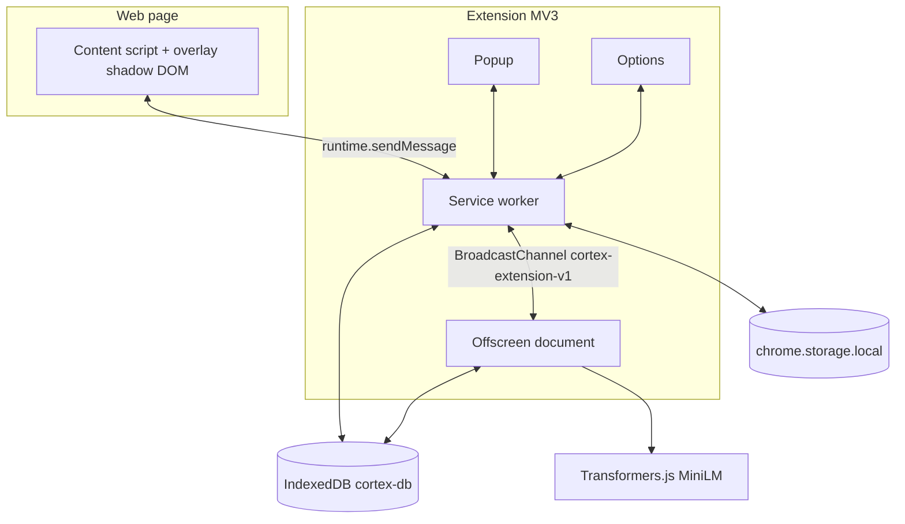

# Cortex extension — handoff report for Claude / reviewers

**Purpose:** Single document describing **architecture**, **frontend surfaces**, **data flows**, **what is implemented vs missing**, **stress-test checklist**, and **security posture**. Use it to drive gap analysis or implementation instructions.

**Repo root for this project:** `cortex/` (Chrome MV3, Webpack → `dist/`).

**Last aligned with codebase:** Dexie schema **v5** (`conversations`, `messages`, `digestCache`), Ask/Digest tabs, local RAG + optional Gemini cloud chat.

---

## 1. Executive summary

| Layer | Role |
|--------|------|
| **Content script** (`content.js`) | Page text extraction, SPA hooks, **shadow-DOM overlay** (Search / Ask / Digest). |
| **Service worker** (`service-worker.js`) | Indexing gates, DB writes, embedding queue, **`chrome.history`** import, relays search/chat/digest via **BroadcastChannel** + offscreen. |
| **Offscreen** (`offscreen.js`) | Transformers.js embeddings, **`runAdvancedSearch`**, **`runChat`**, **`generateDigest`**. |
| **Popup / Options** | Stats, privacy, chat settings (mode, cloud toggle, API key field). |
| **Storage** | **IndexedDB** (`cortex-db`), **`chrome.storage.local`** (`extension-settings.ts`). |

**Privacy stance (design):** Indexed text stays local; **cloud chat** is optional and sends **retrieved context + question** to Google Gemini when user enables it and supplies an API key (stored in `chrome.storage.local` — see security section).

**Storage:** Before persisting a new index payload, **`ensureIndexingHeadroom()`** evicts **least-recently visited** whole documents until **`documentCount < MAX_DOCUMENTS`** and chunk totals stay under chunk budget; **`chrome.alarms`** repeats this every **6 hours** (`cortex-evict-storage`). This does **not** yet enforce byte totals or per-domain quotas — see §10.

**CI:** **GitHub Actions** (`.github/workflows/ci.yml`) runs typecheck, test, build — assumes repo layout **`project/cortex/`** (adjust `working-directory` if your remote root is only `cortex/`).

---

## 2. Architecture diagram (logical)



---

## 3. Message & bus contracts

### 3.1 `chrome.runtime.sendMessage` (content ↔ SW)

Representative `type` values (non-exhaustive; grep `service-worker.ts` for truth):

| Type | Direction | Notes |
|------|-----------|--------|
| `CORTEX_INDEX` | CS → SW | Payload: url, title, text, summary, visitedAt. Gated by privacy. |
| `CORTEX_SEARCH` | Overlay → SW | Query string; SW forwards to offscreen `CORTEX_SEARCH_RUN`. |
| `CORTEX_CHAT_START` | Overlay → SW | `question`, optional `conversationId`. SW posts **`chat-run`** on bus. |
| `CORTEX_DIGEST_START` | Overlay → SW | `range`, optional `forceRegenerate`. |
| `CORTEX_STATS` | Popup/options → SW | Optional `tabUrl` / `tabIncognito`. |
| `CORTEX_CLEAR_ALL_DATA` | Options → SW | Wipes index + chat tables + digest cache. |
| `CORTEX_HISTORY_IMPORT_*` | Options → SW | Bounded `daysBack` / `maxUrls`. |
| `CORTEX_OPEN_TAB` | Overlay → SW | Opens **http/https** tab only (validated in SW). |
| `CORTEX_EMBED_TEXT` / `CORTEX_SEARCH_RUN` | SW ↔ OS | Handled in **offscreen** listener; SW ignores these types in its main listener. |

Push events **SW → content:** `CORTEX_OPEN_SEARCH`, `CORTEX_CHAT_PUSH`, `CORTEX_DIGEST_PUSH`.

### 3.2 BroadcastChannel (`extension-bus.ts`)

Channel name: **`cortex-extension-v1`**.

**Inbound (SW → offscreen):** `chat-run`, `digest-run` (typed in `CortexBusInbound`).

**Outbound (offscreen → SW):** `chat-event`, `digest-done`, `digest-error`. SW forwards to the originating tab via `chrome.tabs.sendMessage`.

---

## 4. Data model (IndexedDB)

**File:** `src/db/schema.ts`

| Store | Purpose |
|-------|---------|
| `documents` | Per-URL metadata, engagement roll-up. |
| `chunks` | Chunk text, optional embedding, `embedState` lifecycle. |
| `visitLog` | Time-filtering for search. |
| `pages` | Legacy migration source. |
| `conversations` / `messages` | Ask tab persistence (v5). |
| `digestCache` | Cached digest JSON per range. |

**Dexie versions:** 1–5 (chat + digest stores added in **v5**).  
**Note:** Root `ARCHITECTURE.md` may still mention “v4 only”; treat **`schema.ts`** as source of truth.

---

## 5. Retrieval & Ask (RAG + LLM)

- **Search core:** `src/lib/search-engine.ts` — BM25 + cosine fusion, recency, engagement; optional time range from `query-parse` / question parser.
- **Ask pipeline:** `src/lib/chat/chat-engine.ts` — parse question → `runAdvancedSearch` with chunks → `buildChatPrompt` → `llm-router` (`nano-client` / Chrome built-in vs `gemini-client`).
- **Digest:** `src/lib/chat/digest-engine.ts` + `digest-cache.ts`.

- **Eval / regression:** **`tests/eval/search-eval.test.ts`** runs **on every `npm run test`**: loads **`tests/eval/fixtures/search-eval-corpus.json`** (synthetic library) + **`search-eval-queries.json`**, mocks Dexie the same way as unit tests, asserts **≥ 85%** of fixture queries pass ranking expectations. **Upgrade path:** export a real IndexedDB snapshot from a profile with ~100 pages, replace or merge into fixtures, and tighten thresholds — synthetic data catches fusion regressions but not real-world calibration.

---

## 6. Frontend surfaces

### 6.1 Overlay (`src/content/overlay.ts` + `overlay.shadow.css`)

- **Tabs:** Search | Ask | Digest.
- **Search:** Hybrid results, keyboard nav, `esc()`-escaped HTML where strings are interpolated.
- **Ask:** Message list, composer at bottom, Send + Enter, citation links and URL linkification via `appendTextWithUrls` + `safeHttpHttpsHref`.
- **Digest:** Loads via `CORTEX_DIGEST_START`, renders structured narrative/topics/sources.

**DOM XSS notes:** Prefer `textContent` + constructed nodes; template literals that include hits should continue to use **`esc()`** for any page-derived strings.

### 6.2 Popup / Options

- **Popup:** `popup.ts` — stats, link to options.
- **Options:** Privacy blocklist/pause, stats, **chat mode**, cloud toggle, Gemini API key, save actions (`options.ts`).

### 6.3 Branding

- Fonts: `styles/brand-fonts.ts`, copied assets under `fonts/`, icons via `npm run icons`.

---

## 7. Build & toolchain

- **Build:** `npm run build` (Webpack, `dist/`).
- **Typecheck:** `npm run typecheck` (`tsc --noEmit`).
- **Unit tests + eval:** **Vitest** — `npm run test`, `npm run test:watch`, `npm run test:ui`.
  - Covered today (non-exhaustive): `url-security`, `rate-limiter`, `context-builder` (chunk budget), `llm-router.decideRoute`, `search-engine.runAdvancedSearch` (mocked Dexie), `digest-engine.parseDigestOutput`, **`tests/eval/search-eval.test.ts`** (synthetic corpus, ≥85% queries must pass).

---

## 8. Stress-test matrix (manual + commands)

Run after substantive changes:

```bash
cd cortex
npm install
npm run typecheck
npm run test
npm run build
```

| Area | Action | Expect |
|------|--------|--------|
| **Compile** | `npm run typecheck` | Exit 0. |
| **Unit tests** | `npm run test` | Exit 0. |
| **Bundle** | `npm run build` | Exit 0; `dist/content.js`, `service-worker.js`, `offscreen.js` present. |
| **Fresh profile** | Load unpacked `dist/` | No startup errors in SW console. |
| **Indexing** | Visit news/article HTTPS page | Document + chunks appear; embeddings eventually `embedded` or `failed` with retry policy. |
| **Privacy** | Pause indexing / blocklist | Skip path respected (`privacy.ts`, SW gates). |
| **Incognito** | Browse private window | Not indexed (SW guard). |
| **Search** | Open overlay, query | Results; snippets escaped; Enter opens hit. |
| **Ask** | Long paste | Trim / `maxLength` + server `question_too_long` coherent. |
| **Ask** | Cloud off | On-device or nano path per settings; clear errors from `llm-router`. |
| **Ask** | Cloud on + key | Streams tokens; sources footer populated. |
| **Digest** | Each range | Completes or surfaces timeout/error copy. |
| **History import** | Options trigger | Bounded concurrency; cancel works; no unbounded memory. |
| **Clear data** | Options wipe | All stores empty per `clearAllIndexedData`. |

**Automated regression:** Vitest covers unit-level modules **and** synthetic search eval (`tests/eval/`). **End-to-end fidelity** improves once fixtures are replaced or augmented with an exported real IndexedDB snapshot. Add fuzz/adversarial scripts separately if desired.

---

## 9. Security posture

### 9.1 Implemented controls (recent / ongoing)

- **Extension CSP** (`manifest.json`): `extension_pages` restricts scripts; `wasm-unsafe-eval` for ONNX Web.
- **Link safety:** `safeHttpHttpsHref` / `safeHttpUrl` — only **http/https** hrefs for assistant links, digest links, and **`CORTEX_OPEN_TAB`** (blocks `javascript:` etc.).
- **External links:** `target="_blank"` + `rel="noopener noreferrer"` where links open new tabs.
- **Message sender guard:** Service worker ignores messages when `sender.id` is defined and **≠** `chrome.runtime.id`.
- **Ask abuse:** `CHAT_LIMITS.MAX_QUESTION_CHARS` enforced in SW + textarea `maxLength`.
- **Debug telemetry:** `agent-debug-log.ts` **disabled by default** (localhost ingest would otherwise leak behavioral metadata if a local server listens).

### 9.2 Remaining risks / recommendations

| Risk | Severity | Notes |
|------|-----------|--------|
| **`tabs` + broad `host_permissions`** | Medium | Extension can script any HTTP(S) page per manifest; expected for indexing — document clearly for users. |
| **`history` permission** | Medium | Imports URLs/titles from browser history; gated UI but powerful — audit **history-import** for SSRF-ish fetches (only user history URLs). |
| **Gemini API key in `chrome.storage.local`** | Medium | Encrypted at OS profile level, not E2E secret; advise users to use restricted keys; never ship keys in source. |
| **Cloud LLM exfiltration** | High (user-opt-in) | Retrieved chunks + question leave device — **informed consent** copy should stay prominent in options. |
| **`web_accessible_resources`** | Low–Medium | `models/**/*` exposed; scoped to extension needs — review if tightening is possible. |
| **innerHTML in overlay** | Medium | See **`docs/INNERHTML_AUDIT.md`**; keep **`esc()`** invariant on hit rows. |
| **BroadcastChannel spoofing** | Low | Same extension origin only; not reachable from arbitrary web pages. |

### 9.3 Rate limiting (service worker)

Sliding-window limiter (`src/lib/rate-limiter.ts`): **`CORTEX_CHAT_START`** 10/min/tab; **`CORTEX_SEARCH`** 60/min/tab; **`CORTEX_DIGEST_START`** 5/min/tab; **`CORTEX_INDEX`** 30/min/**domain**; **`CORTEX_HISTORY_IMPORT_START`** 1/min global. Violations return **`RATE_LIMITED`** via `payloadFromCode` (`src/lib/errors.ts`).

### 9.4 Suggested next security tasks

1. Re-run innerHTML audit when editing templates (`docs/INNERHTML_AUDIT.md`).
2. Add **`chrome.tabs.create` validation** anywhere else tabs open from strings.
3. Extend rate limits if new abuse patterns appear (e.g. options-initiated bulk APIs).
4. Options copy: explicit bullet list of what is sent to Gemini when cloud is enabled.
5. Consider **`declarative_net_request`** only if moving away from broad host permissions (major refactor).

---

## 10. Known gaps / “what’s missing” (for Claude instructions)

Use this as a backlog seed:

1. **CI:** GitHub Actions workflow **`.github/workflows/ci.yml`** runs `npm ci`, typecheck, test, build with **`working-directory: cortex`**. If your Git repo root **is** the `cortex` folder (not a monorepo), remove `defaults.run.working-directory` and the `cache-dependency-path` prefix.

2. **Tests:** Expand Vitest + eval fixtures (real IDB export); add red-team / citation-accuracy cases.

3. **Onboarding:** Tab exists; extend to multi-step flow + “moment of magic” sample page.

4. **ARCHITECTURE.md drift:** Keep in sync with Dexie v5, Ask/Digest, eviction, CI.

5. **Eviction / quotas:** **Pre-index headroom** + **`chrome.alarms` every 6h** call `ensureIndexingHeadroom()` (`src/lib/storage-eviction.ts`). Still missing: **byte-accurate** caps (`MAX_TOTAL_BYTES_*`), **per-domain % cap**, **weighted eviction**, **storage dashboard UI** in options.

6. **Accessibility:** Partial — polite **`aria-live`** announcer, search **`aria-label`**, **`prefers-reduced-motion`** for shimmer/cursor; still need **axe DevTools sweep**, full **focus trap** polish (Tab order / roving tabindex), contrast audit.

7. **Error surfaces:** `CortexError` + `payloadFromCode` used in **`CORTEX_INDEX`** (storage full), **`chat-engine`** catch; migrate remaining throws/catches in digest/offscreen/gemini paths.

8. **i18n:** Infrastructure only — adopt **`t()` for new strings**; migrate overlay/popup/options incrementally.

9. **Service worker reliability:** Long embedding queues / history import vs MV3 — persisted checkpoints, **`chrome.alarms` keep-alive** during jobs, watchdog for stuck embed states.

10. **Chrome Web Store:** Draft **`docs/PRIVACY_POLICY.md`** (host at public URL), screenshots, permission justifications, single-purpose description — required before submission.

---

## 11. File map (quick reference)

| Concern | Path |
|---------|------|
| SW orchestration | `src/background/service-worker.ts` |
| Offscreen ML + bus consumer | `src/offscreen/offscreen.ts` |
| IndexedDB | `src/db/schema.ts` |
| Search | `src/lib/search-engine.ts`, `ranking.ts`, `similarity.ts`, `query-parse.ts` |
| Chat | `src/lib/chat/*` |
| Overlay UI | `src/content/overlay.ts`, `overlay.shadow.css` |
| Content entry | `src/content/main.ts`, `extract.ts` |
| Settings | `src/shared/extension-settings.ts` |
| URL safety | `src/lib/url-security.ts` |
| Limits | `src/lib/limits.ts` |
| Errors | `src/lib/errors.ts` |
| Rate limit | `src/lib/rate-limiter.ts` |
| Storage headroom / eviction | `src/lib/storage-eviction.ts` |
| Onboarding | `src/onboarding/*`, `src/shared/onboarding-constants.ts` |
| Tests / eval | `vitest.config.ts`, `src/**/*.test.ts`, `tests/eval/*` |
| CI | `.github/workflows/ci.yml` |
| Store / privacy draft | `docs/PRIVACY_POLICY.md` |
| Manifest | `manifest.json` |

---

*Generated as a handoff artifact; keep in sync when changing messaging contracts or schema versions.*
